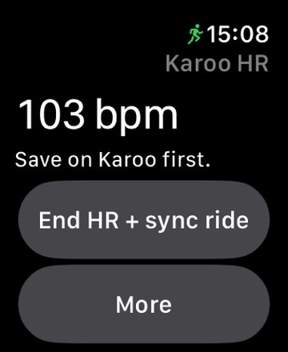
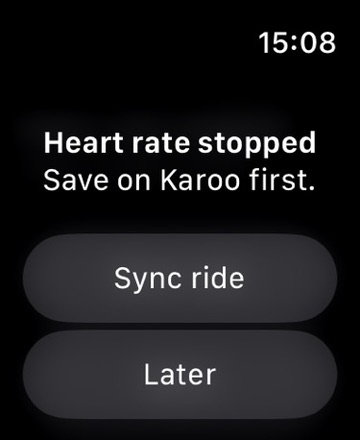
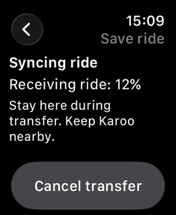
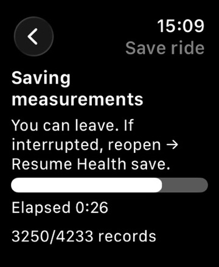
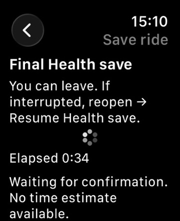
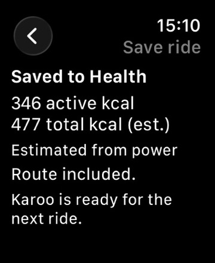
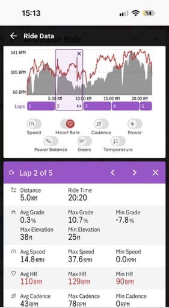
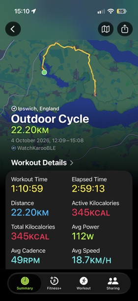

# Karoo HR

**Use your Apple Watch as a heart-rate sensor for Karoo, and import saved Karoo rides into Apple Health. Use either function independently.**

Karoo records the ride. Your Watch sends live heart rate directly over Bluetooth, without a chest strap or bridge device. Afterwards, import the ride into Health with its **GPS route, heart rate, distance, calories and available speed, cadence and power**. Older rides and rides recorded with another sensor can be imported too.

Ride transfer and Health saving need **no internet or Karoo cloud upload**. Your normal Karoo-to-Strava sync can stay enabled.

## What’s new

- **Public beta:** clearer save completion and back navigation, with release notes available on Watch. Interrupted Health saves can resume; missing calories can be estimated without adding duplicate resting energy.
- **In internal testing:** automatic heart-rate reconnection for up to five minutes, remembered Watch pairing and reception recovery after a Karoo restart. Both apps need the recovery update. Reboot and out-of-range testing is still pending.

### Releases and downloads

| Release | Watch | Karoo | Availability |
| --- | --- | --- | --- |
| Public beta | 1.4 (28) | 1.4 (20) | [Join TestFlight](https://testflight.apple.com/join/CcbZKYg6) · [Download Karoo APK](https://github.com/paddywills/karoo-sync/releases/download/karoo-1.4-build20/KarooHR-1.4-build20.apk) |
| Recovery update | 1.4 (29) | 1.4 (21) | Internal testing only; installed on the test devices. Not in the public downloads yet. |

Check your versions on Watch under **More → Help & version** and on Karoo under **More**. The main instructions below cover the public beta; the internal recovery changes have their own section.

## Install

You need an **Apple Watch running watchOS 10 or later**, paired with an **iPhone running iOS 17 or later**, and a **2024 / third-generation Karoo**. Karoo 2 has not been verified. Both apps are needed for either function. No computer, Xcode or Developer Mode is required.

1. **Watch:** install TestFlight on your iPhone, open the joining link above, accept the beta and install Karoo HR on Watch. There is no separate Karoo HR phone app.
2. **Karoo:** download the APK above to **Files** on your iPhone. Press and hold it → **Share → Hammerhead Companion**, then tap **Install** on Karoo. Installation needs both devices online and connected through Companion. [Illustrated installation guide](https://support.hammerhead.io/hc/en-us/articles/31576497036827-Companion-App-Sideloading).

Install updates over the existing apps. Watch updates arrive through TestFlight; Karoo updates are on [GitHub Releases](https://github.com/paddywills/karoo-sync/releases).

## Set up

Open **Karoo HR → Enable reception** on Karoo and allow Bluetooth access. Then set up whichever function you want.

### Use Watch heart rate

1. Tap **Start HR** on Watch. Allow Heart Rate read access and the requested workout permission.
2. Approve the **matching letter** on Karoo. Complete Bluetooth pairing if asked; keep Karoo HR open on Karoo to enter the code shown on Watch.
3. Once heart rate appears, pair **Karoo HR (Apple Watch)** in Karoo’s **Sensors** settings and add a Heart Rate field to your riding profile.
4. Optionally add the full-page **Karoo HR** data field to your profile for status and letter approval while riding. It appears among your profile’s ride pages.

Only the approved Watch supplies heart rate. Another nearby Watch needs your approval.

### Import rides into Apple Health

1. On Karoo, open **More → Set up ride sync** and allow access to saved rides.
2. Disable Hammerhead’s Apple Health export and any other app’s Health export of the same rides to avoid duplicates. Karoo-to-Strava uploads can stay enabled; check Strava’s separate Health export setting.
3. At the first import, allow Health **write access** for workouts, routes and ride measurements. Allow **read access to Workouts** for duplicate detection and save recovery, and **Resting Energy** for the calorie split.

Ride import works without starting HR or setting up Karoo’s heart-rate sensor. Live HR works without setting up ride imports.

## Ride

**Start:** enable reception on Karoo, tap **Start HR** on Watch, confirm heart rate on Karoo, then record your ride normally.

**While riding:** lower your wrist or return to the Watch face normally. You can leave the Karoo HR screen too. Watch uses a temporary workout for frequent readings and discards it when sharing ends. Apple may still retain individual heart-rate or Activity samples.

**Finish:** finish and save the ride on Karoo first. Watch then stops HR and offers **Sync ride** or **Later** when it receives the ride-ended signal. If the reminder does not arrive, choose **End HR + sync ride** yourself. A pause or lost connection never counts as a finished ride. Reception stays enabled for next time unless you disable it.

### If the connection drops

Bring the devices together and check that reception is enabled. If Karoo restarted, use **Resume Ride** if offered, then reopen Karoo HR and **Enable reception**. On Watch, tap **Start HR**; look under **More** if it is not on the home screen. Approve the matching letter again if asked, and check that fresh HR returns.

Karoo continues recording if Watch disconnects or runs out of battery. Missing HR readings are not backfilled, but a ride saved on Karoo can still be imported into Health later.

<strong>Internal testers: automatic recovery</strong>

With the recovery update installed on both devices:

- Leave Watch running while it shows **Reconnecting…**. It keeps measuring for up to five minutes; you can lower your wrist normally.
- After a Karoo reboot, choose **Resume Ride** if offered. Reception restarts if previously enabled, and the remembered Watch should reconnect without letter approval. Complete the initial Bluetooth pairing when requested so your Watch can be remembered.
- If recovery times out, Watch stops and discards its temporary session, alerts you and offers **Reconnect**. Resume the Karoo ride first, then tap it. If needed, open Karoo HR and **Enable reception**.
- **Disable reception** deliberately stops HR. If Watch is out of range, use **Stop HR** on Watch to end it immediately, or let the recovery window expire.
- To use a different Karoo, stop HR and choose **More → Help & version → Pair another Karoo** on Watch.

Check that fresh HR returns after recovery. A lost connection never means the ride has ended, and recovery cannot recreate missing measurements or an unsaved ride.

## Save a ride to Apple Health

1. **Finish and save the ride on Karoo first.** No cloud upload is needed.
2. Choose how to select the ride:
   - **After Watch HR sharing:** choose **Sync ride** from the reminder, or **End HR + sync ride** if still sharing.
   - **For any saved ride:** choose **More → Earlier rides** on Karoo and select it, then **More → Earlier rides** on Watch. This also works for your latest ride, with or without recorded heart rate.
3. Keep the devices nearby and **stay in the Watch app during Bluetooth transfer**. Approve pairing if asked.
4. Once Health saving starts, **you can return to the Watch face**. Karoo and internet are no longer needed. Saving can take several minutes. If interrupted, reopen the app → **Resume Health save**; do not restart or retry while Health is working.
5. Wait for **Saved to Health**, then use the top-left arrow to return home. After Watch/iPhone syncing, check the workout and route in Apple Health/Fitness.

Avoid importing a ride already saved by HealthFit or another app. Available measurements depend on what Karoo recorded.

### From riding to saved in Health

Follow the ride from live heart rate to a completed Health save. For import only, start with **More → Earlier rides**, then follow screenshots 3–6. Read left to right; readings and times are examples.

| 1. Live heart rate | 2. Ready to sync | 3. Bluetooth transfer |
| :---: | :---: | :---: |
|  |  |  |
| Finish and save on Karoo first, then tap **End HR + sync ride**. | When sharing has stopped, tap **Sync ride** to import the saved ride. | **Stay in the Watch app** and keep Karoo nearby until transfer finishes. |

| 4. Saving measurements | 5. Final Health save | 6. Saved to Health |
| :---: | :---: | :---: |
|  |  |  |
| You can leave the app during Health saving. If interrupted, reopen it and choose **Resume Health save**. | Wait for Health confirmation; this stage has no time estimate. | The Watch confirms the save and shows the calorie summary and whether the route is included. Check Health/Fitness after Watch and iPhone syncing. |

### Recorded on Karoo, saved to Apple Health

Karoo records the heart-rate trace with your ride. After import, Apple Fitness displays the workout and route saved to Health.

| Heart rate recorded with the ride | Imported workout in Apple Fitness |
| :---: | :---: |
|  |  |
| The heart-rate graph confirms that readings were recorded in the Karoo ride. The selected lap also shows average, maximum and minimum heart rate. | The route and ride measurements appear in Fitness after Health syncing. Available measurements depend on what Karoo recorded. |

The Fitness summary does not show every stored measurement; check Apple Health for the imported heart-rate data. In this example, Fitness displays the same active and total calories, as described below. Apple Health may retain the older **WatchKarooBLE** source name on existing records.

## Battery and calories

In my testing, Watch battery use is similar to recording a normal cycling workout. **Plan on around two hours**, depending on model, battery health and starting charge; this is not a guaranteed runtime.

Recorded active calories are used when available. Otherwise, sufficiently complete recorded power can provide an estimate. Karoo HR shows active calories and an estimated total including resting energy during active riding. It saves active calories to Health and keeps the total estimate in workout metadata. **Fitness may display the same figure for active and total calories.** Karoo HR never adds derived resting-energy entries.

## Help and feedback

For connection trouble, check reception and pairing. For an import, check the ride is saved and file access is granted. Read release notes on Watch under **More → What’s new**; they also appear once after an update.

[Report an issue](https://github.com/paddywills/karoo-sync/issues/new?template=report.yml) using the short GitHub form, or open **More → Report an issue** on Watch. GitHub sign-in is required. Include both app versions and what happened. Reports are public: leave out email addresses, private routes and Health data. TestFlight and email feedback are reviewed manually.

## Beta disclaimer

Karoo HR is independent beta software and is not affiliated with or endorsed by Apple, Hammerhead or SRAM. It is provided “as is”, without warranty. Install and use it at your own risk. To the extent permitted by applicable law, the developer accepts no liability for damage to your Apple Watch, Karoo or other equipment, loss or corruption of ride or Health data, or other loss arising from its use. Nothing in this notice excludes liability that cannot legally be excluded.

[Privacy and contact details](https://github.com/paddywills/karoo-sync/blob/main/PRIVACY.md) · [Third-party acknowledgements](https://github.com/paddywills/karoo-sync/releases)
